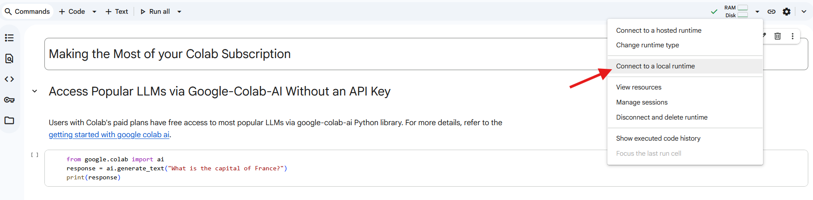

# Enviroment

In this section, we’ll learn how to use **conda (micromamba)** and **containers** (Docker, Singularity) to manage your software environment effectively.

>*"But it works on my laptop..." - whispered by generations of grad students.*

---

## 1. Micromamba

Micromamba is a lightweight, fast reimplementation of conda. You can use it to create, activate, and manage isolated environments for reproducible research.

1. Create and activate the environment

Examine the `.yaml` file and make sure you understand the role of each section
```bash
micromamba create -f bioinfo_example.yaml
micromamba activate bioinfo_example
```


2. Run example scripts

Once the environment is active, test it by running the provided scripts:

```bash
python example.py
Rscript example.R
```

3. Adding New Packages

While working on your project, you realized that it would be convenient to call R functions in your python scripts. Install `rpy2` using the command below
```bash
micromamba install rpy2
```

4. Export the updated environment

```bash
micromamba env export --from-history > bioinfo_example_latest.yaml
```

The `--from-history` flag ensures that only explicitly installed packages are saved, keeping the environment file clean and minimal.

Compare the new YAML file (`bioinfo_example_latest.yaml`) with the original one. What changes do you notice?

Answer the following questions:
- What micromamba command can you use to list all created environemnts?
- What micromamba command can you use to list all packages installed in a specific environment?
- What micromamba command can you use to remove a package?
- What micromamba command can you use to install a package from a specific channel?
- What micromamba command can you use to remove an environment?


- What are all the `r-base` and `Bioconductor` packages that were installed in the `bioinfo_example` environment?
*(Hint: You may want to use one of the commands from your answers to the above questions, and combine it with the `grep` command.)*

>Remember to push the updated environment file and example outputs to your GitHub repository. Include your output plots and any observations in your write-up.


# Container

You will practice writing Docker image build instruction, push it to container registries (`Docker Hub` & `Stanford GitLab`), use Singularity to create container (`.sif`) image on Farmshare, mount your `$SCRATCH` directory to container, and run **code-server** or **JupyterLab** over an SSH tunnel.

1. Set up Docker Hub and Stanford Gitlab connection 

- On your laptop
  ```bash
  docker login
  ```
- On Farmshare
  ```bash
  singularity remote login -u $USER docker://scr.svc.stanford.edu
  ```

> **Why Docker + Singularity?**  
> Docker is great locally but **not allowed** on shared HPC for security reasons. Singularity (a.k.a. Apptainer) runs containers **without root** suitable for HPC environments.

---

2. Build Docker image

- Clone your fork locally and navigate to `Environment` directory.
- Build Docker image, this will take about 10 minutes. 

```bash
docker build -t bioinfo_example .
```

- After image is built, push it to Docker Hub and Stanford Gitlab Container Registry. Before doing so, you need to tag the image name with the path to container registry. It will take a while to push the image, you know the trick, `tmux`!

```bash
# Tag and push to Docker Hub
docker tag bioinfo_example <DockerHub_Username>/bioinfo_example
docker push <DockerHub_Username>/bioinfo_example
# Tag and push to Stanford Gitlab (On another tmux session/window)
docker tag bioinfo_example scr.svc.stanford.edu/<SUNetID>/containers/bioinfo_example
docker push <DockerHub_Username>/bioinfo_example
```

3. Pull image to Farmshare with Singularity. You can pull from either registry

```bash
singularity pull docker://scr.svc.stanford.edu/<SUNetID>/containers/bioinfo_example
```
After finished, you should see a file `bioinfo_example_latest.sif`. That's all you need for a reproducible environment! Now run 

```bash
singularity run `bioinfo_example_latest.sif` 
```
And test if everything runs well (python, R, rclone, etc...)

Create an example `python` file in your `$SCRATCH` that prints "Hello World!" and execute the file with your singularity container. Can you run it? Why do you think this is the case? *(Hint: -B flag)*

4. Writing your own `Dockerfile`

Write a custom docker image based on the image you already built *(Hint: What base image can you indicate for the `FROM` command)*

You want to include 2 more tools from the base image
- `parasail` for pairwise sequence alignment and you want to install this via `pip`
- `reseek` for protein structure search. The tool is provided as binary file on [github](https://github.com/rcedgar/reseek/releases/download/v2.7/reseek-v2.7-linux-x86)

Build the image and push to `Docker Hub` and `Stanford Gitlab` with a new `tag`named `bioinfo_example:v2`

5. Pull a more comprehensive container to Farmshare, you will use this container for the rest of the course

```
singularity pull docker://scr.svc.stanford.edu/khoang99/containers/bioinformatics
```

6. Run code-server and jupyter lab 

Tunnel a port from Farmshare back to your laptop so you can use browser apps.

On your **laptop** (ideally in a tmux session)

Pick a random ```PORT``` from 20,000 to 30,000 and keep this tunnel running:
```bash
ssh [SUNetID]@login.farmshare.stanford.edu -NL <PORT>:localhost:<PORT>
```
- `-N` no remote command
- `-L <PORT>:localhost:<PORT>` forwards **local PORT → remote PORT**

On **Farmshare** (remote), start the service inside the container

+ code-server (VS Code in the browser):
```bash
singularity run -B /farmshare/users/[SUNetID],/farmshare/home/classes/bios/270 bioinformatics_latest.sif \
  code-server --bind-addr 127.0.0.1:<PORT> --auth none
```

+ JupyterLab:
```bash
singularity run -B /farmshare/users/[SUNetID],/farmshare/home/classes/bios/270 bioinformatics_latest.sif \
  jupyter lab --ip 127.0.0.1 --port <PORT> \
  --NotebookApp.allow_origin='https://colab.research.google.com' \
  --NotebookApp.port_retries=0 --no-browser
```

+ Google Colab

You can use Google Colab IDE by clicking `Connect to a local runtime` and pasting the jupyter notebook URL above


